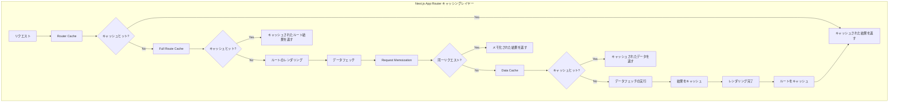
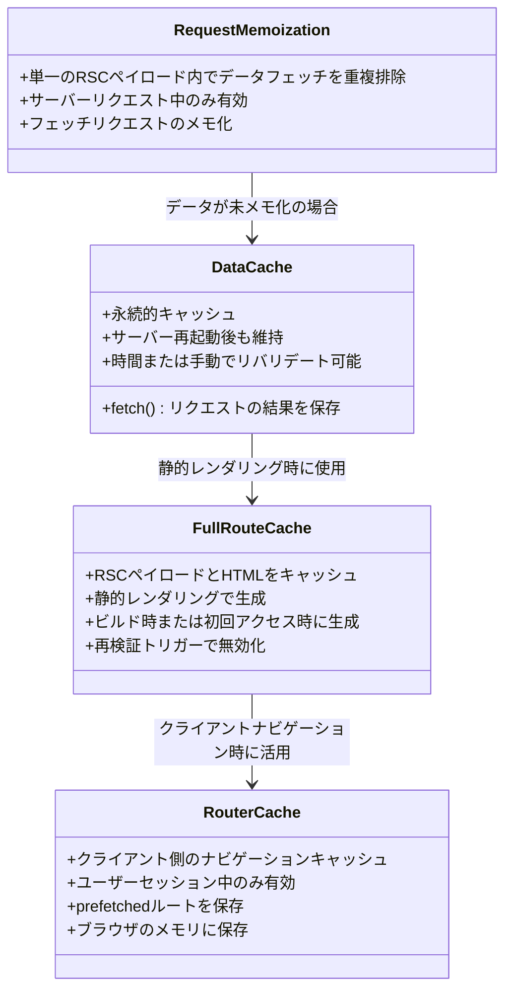
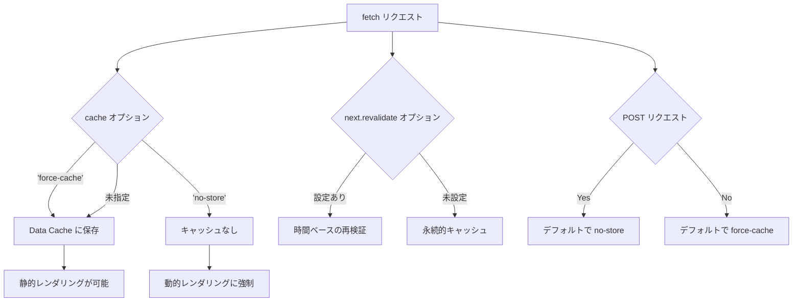
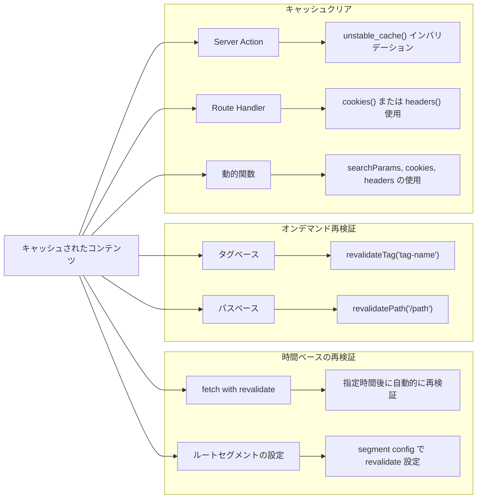
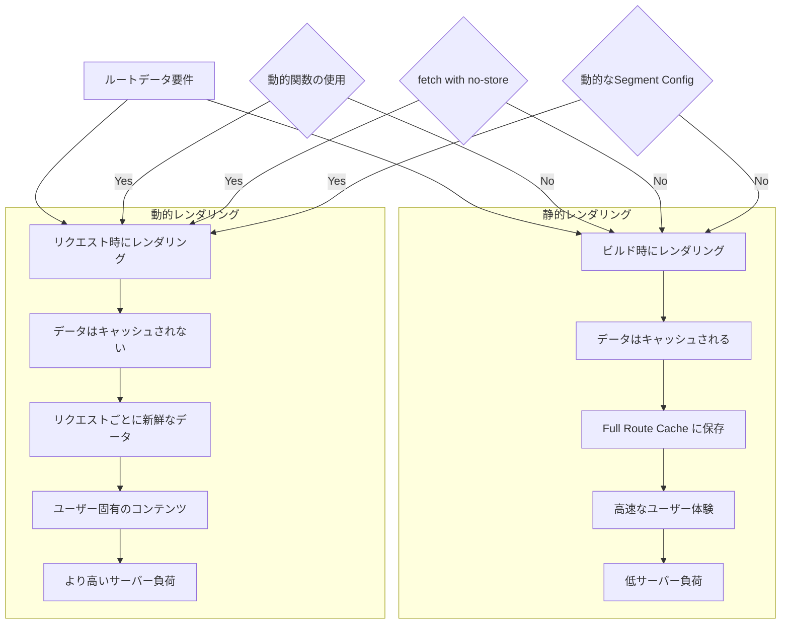
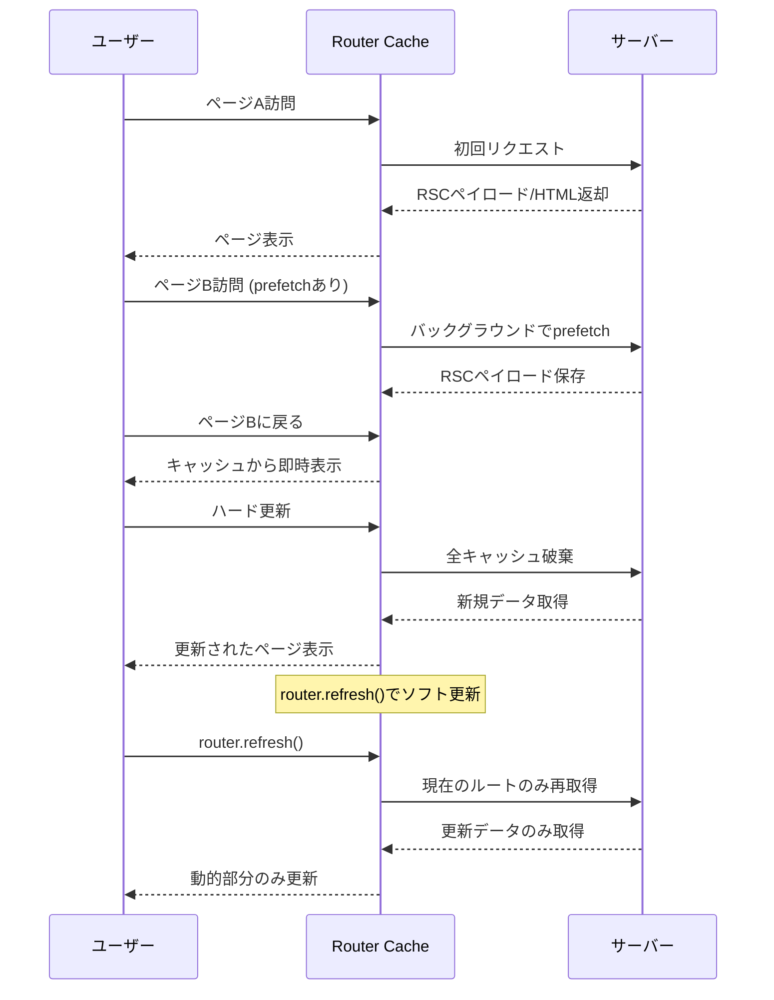
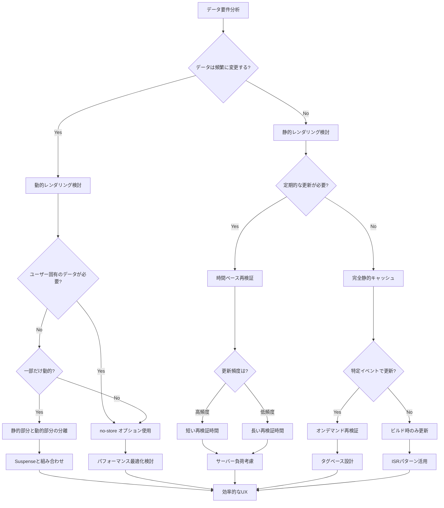

# Caching

App Router のキャッシュに関するドキュメントと図解

## Next.js App Router キャッシングレイヤー

キャッシングの全体的なフローを視覚化し、各キャッシュレイヤーがリクエストをどのように処理するかを示しています。
Router CacheからData Cacheまでの一連の処理とキャッシュヒットの判断ロジックを表現しています。

## Next.js キャッシュの種類と関係性

クラス図を使用して、4つの主要なキャッシュタイプ（Request Memoization、Data Cache、Full Route Cache、Router Cache）の特性と関係性を示しています。
各キャッシュの役割と相互作用を明確に表現しています。

## fetch() オプションとキャッシュ動作

fetch()関数の各種オプション（cache、revalidate）がキャッシュ動作にどう影響するかをフローチャートで示しています。
POSTリクエストのデフォルト動作やレンダリングへの影響も表現しています。

## Next.js キャッシュの再検証方法

時間ベースの再検証とオンデマンド再検証、およびキャッシュクリアの方法を整理して示しています。
revalidateTag、revalidatePath、動的関数の使用など、各種再検証方法を並列して表示しています。

## 静的レンダリングと動的レンダリングの比較

静的レンダリングと動的レンダリングの特性、メリット、使用条件を対比して示しています。
どのような条件で動的レンダリングが選択されるかを明確にしています。

## Router Cache の動作と制御

シーケンス図を使って、ユーザーのナビゲーションとRouter Cacheの相互作用を時系列で示しています。
prefetch、ハード更新、router.refresh()などの動作の違いを表現しています。

## キャッシュ戦略の決定フロー

プロジェクトのデータ要件に基づいて、適切なキャッシュ戦略を選択するための意思決定フローを示しています。
静的vs動的、再検証頻度、ユーザー固有データの必要性などの条件分岐を含みます。

