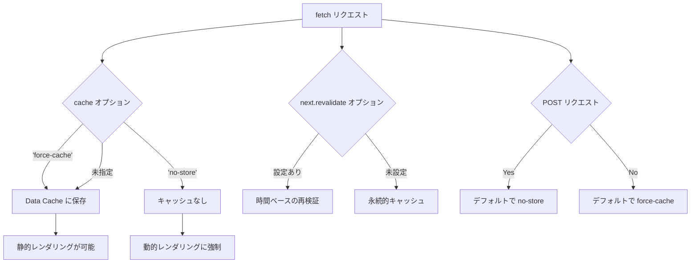
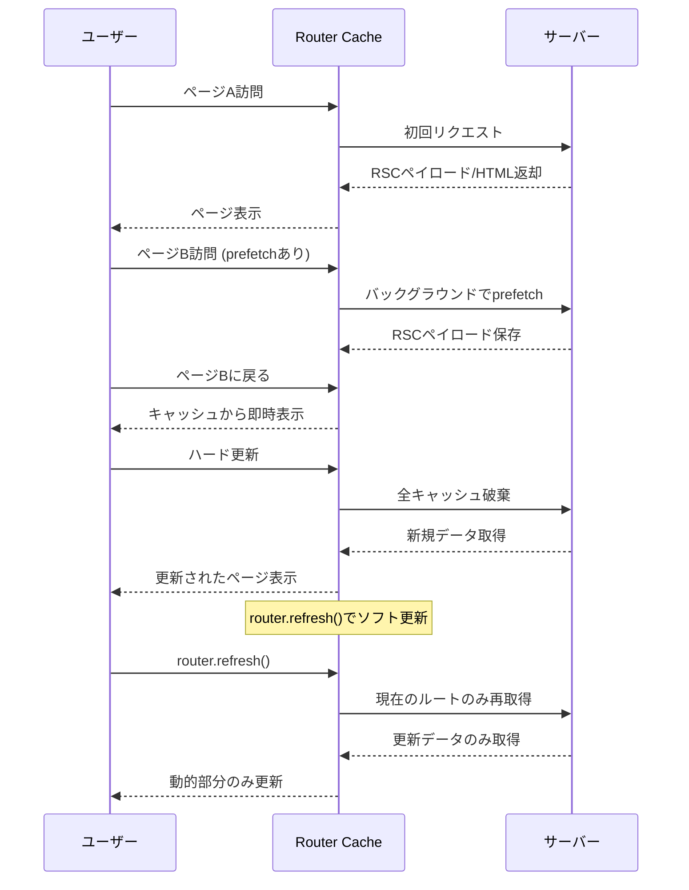
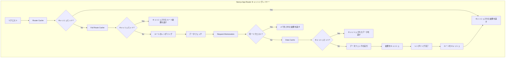
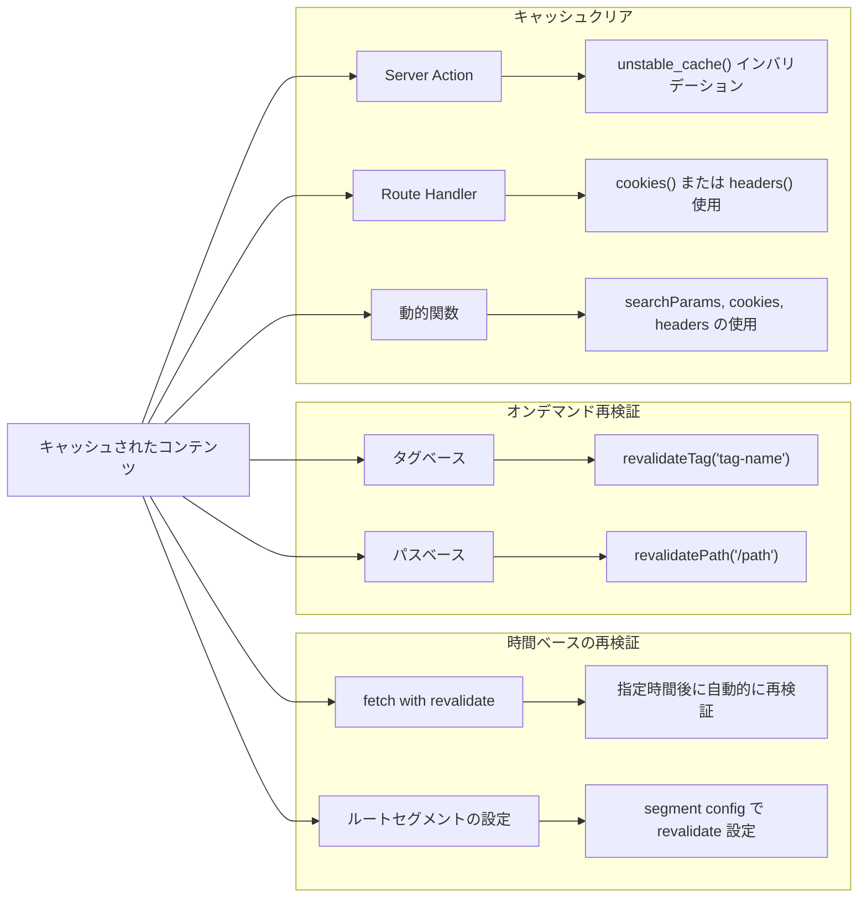
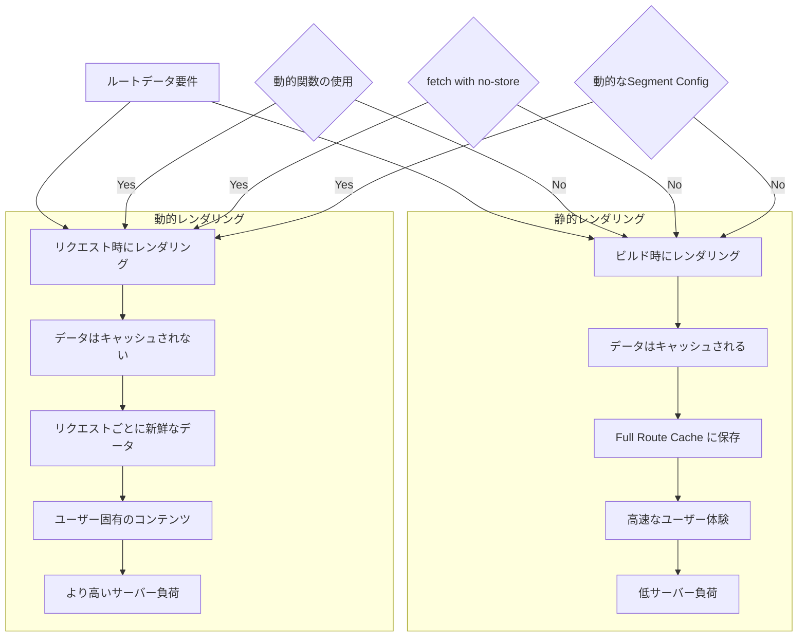
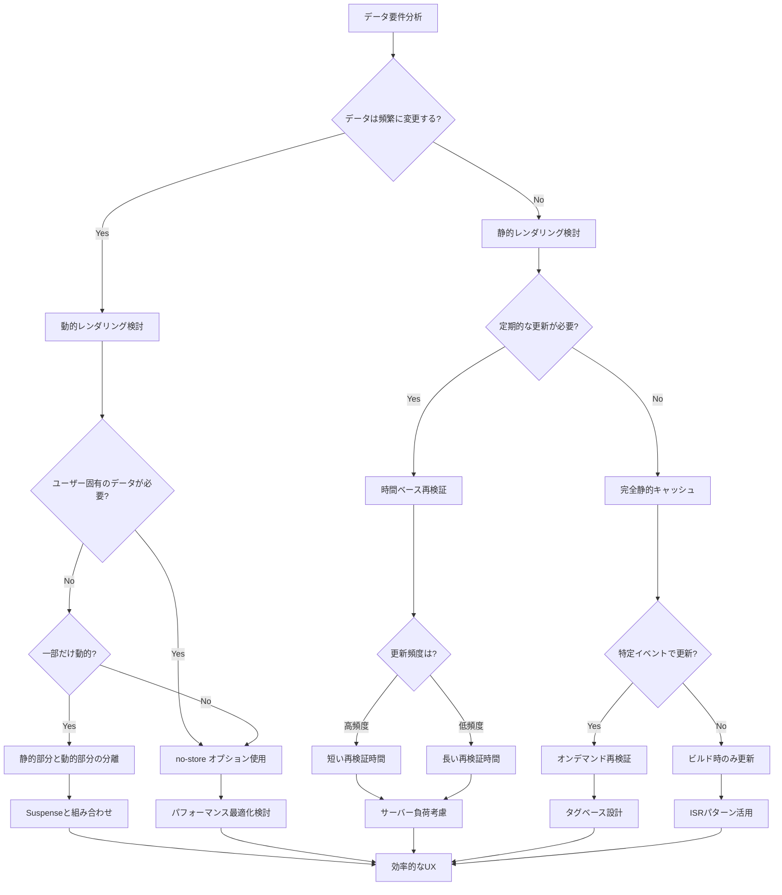

# 07 Caching

App Router のキャッシュに関するドキュメントと図解

## 1. イントロダクション

なぜ Next.js のキャッシングについて理解することが重要なのでしょうか？
それは単純に、適切なキャッシング戦略を実装することで以下を実現できるからです。

- ウェブサイトのパフォーマンスが劇的に向上する
- サーバーへの負荷を減らしてコストを削減できる
- ユーザー体験を向上させることができる

App Router のキャッシングは大きく分けて4つのレイヤーがあります。

- Request Memoization（リクエストメモ化）
- Data Cache（データキャッシュ）
- Full Route Cache（フルルートキャッシュ）
- Router Cache（ルーターキャッシュ）

## 2. キャッシングの基本概念

まず、Next.js におけるキャッシングとは何かについて基本から説明します。
キャッシングとは、一度取得したデータや生成したコンテンツを一時的に保存しておき、同じリクエストがあった場合に再計算や再取得せずに保存したものを返す仕組みです。これにより：

- データベースへのクエリ回数が減少
- API呼び出しが減り
  レンダリング処理が省略され
  結果として応答時間が短縮されます

Pages Router と App Router では根本的なアーキテクチャが異なります。

### Pages Router のキャッシング

- getStaticProps による Static Generation
- getServerSideProps によるServer-side Rendering
- Incremental Static Regeneration (ISR)

これらは比較的シンプルで理解しやすい仕組みでした。
ページ単位でキャッシング戦略を決定し、\_app.js や \_document.js で共通の設定を行うことができました。

### App Router のキャッシング

- React Server Components をベースにした新しいアーキテクチャ
- コンポーネントレベルでのきめ細かいキャッシング制御
- ルートセグメントごとに異なるキャッシング戦略を適用可能
- 複数のキャッシングレイヤーによる階層的な仕組み

App Router のアプローチは柔軟性が高く、パフォーマンスの最適化においてより多くの可能性を提供します。しかし、その複雑さから初めは混乱することも多いでしょう。
パフォーマンスへの影響としては、適切にキャッシングを設定することで：

初回読み込み時間（TTFB: Time to First Byte）の短縮
サーバーリソースの効率的な利用
より良いユーザー体験
高トラフィック時の安定性向上

といった大きなメリットがあります。
それでは、App Router の各キャッシングレイヤーについて詳しく見ていきましょう。

## 3. App Routerにおけるキャッシングレイヤー

App Router では、4つの主要なキャッシングレイヤーが互いに連携しています。それぞれのレイヤーは異なる目的と動作を持っており、全体として効率的なキャッシングシステムを構成しています。

### Request Memoization（リクエストメモ化）

Request Memoization は、単一のレンダリングパス内で同じリクエストが複数回行われた場合に、最初の結果を再利用する仕組みです。

- React のレンダリングサイクル内でのみ有効
- サーバーのメモリ内で一時的に保持される
- 同一リクエストの重複を防ぎ、パフォーマンスを向上

例えば：
同じコンポーネントツリー内で同じデータを複数回フェッチする場合、実際のネットワークリクエストは1回だけ行われます。これにより、特に複雑なコンポーネント構成を持つアプリケーションでパフォーマンスが向上します。

### Data Cache（データキャッシュ）

Data Cache は、fetch リクエストの結果をサーバー上にキャッシュする仕組みです。
Request Memoization とは異なり、レンダリングサイクルを超えて永続化されます。

- デフォルトで有効（特に fetch() を使用する場合）
- ファイルシステムベースのキャッシュストレージ
- キャッシュキーはURL、オプション、ヘッダーに基づいて生成

### Full Route Cache（フルルートキャッシュ）

Full Route Cache は、静的にレンダリングされたルートの HTML と RSC（React Server Component）ペイロードをキャッシュします。従来の Static Site Generation (SSG) に相当します。

- ビルド時または初回リクエスト時に生成されるキャッシュ
- デフォルトで静的ルートに対して有効
- 動的ルートではキャッシュされない

### Router Cache（ルーターキャッシュ）

Router Cache は、クライアントサイドのブラウザメモリ内に保持される一時的なキャッシュです。ユーザーがアプリケーション内を移動する際の体験を向上させます。

- クライアントサイドのみで機能
- ナビゲーション中のルート間でデータを共有
- セッション中のみ有効（ページのリロード時にクリア）
- プリフェッチされたルートも含む

e.g.

1. ユーザーが製品リストページから製品詳細ページに移動
2. 詳細ページが Router Cache に保存される
3. ユーザーが製品リストに戻り、再び同じ製品詳細を開く
4. キャッシュから即座に表示（サーバーリクエストなし）

シーケンス図を使って、ユーザーのナビゲーションとRouter Cacheの相互作用を時系列で示しています。
prefetch、ハード更新、router.refresh()などの動作の違いを表現しています。

### キャッシングレイヤーの連携

これら4つのレイヤーは以下のように連携します。

1. ユーザーがページにアクセスすると、まず Router Cache をチェック
2. キャッシュにない場合、サーバーでの処理が開始
3. サーバーでは、まず Full Route Cache をチェック
4. ルート生成中に必要なデータは Data Cache から取得
5. 同一レンダリングサイクル内での重複リクエストは Request Memoization で最適化

## 5. キャッシュの無効化とリバリデーション (8分)

キャッシュの利点を活かしながら、データの鮮度を保つためには、適切なタイミングでキャッシュを無効化（再検証）する必要があります。Next.js App Router では、主に2つの再検証方法が提供されています。

- 時間ベースの再検証 (Time-based Revalidation)
- オンデマンド再検証 (On-demand Revalidation)

### 時間ベースの再検証 (Time-based Revalidation)

時間ベースの再検証は、指定した時間間隔でキャッシュを自動的に更新する方法です。

- 設定が簡単で自動的に動作する
- トラフィックに関係なく定期的に更新される
- キャッシュの有効期限が切れると、次のリクエストで新しいデータが取得される
- その間、古いキャッシュが提供され続ける（バックグラウンドで再検証）

### オンデマンド再検証 (On-demand Revalidation)

オンデマンド再検証は、特定のイベント（例：CMS でのコンテンツ更新）が発生したときに、プログラムでキャッシュを無効化する方法です。
2種類のメソッドを用いて実行可能です。

- revalidatePath ( パスによる再検証 )
- revalidateTag ( タグによる再検証 )

また、Server Actions 内でもこの2つのメソッドを用いて直接再検証が可能です。

### 図解

### キャッシュのクリア方法

#### 開発中にキャッシュをクリアする方法

- 開発サーバーの再起動
- Router Cache のクリア：ブラウザでページをハード更新（Ctrl+F5 または Cmd+Shift+R）
- Data Cache のクリア：.next/cache ディレクトリを削除

#### 本番環境でのキャッシュクリア

- デプロイメントの再実行：Vercel などのホスティングプラットフォームで新しいデプロイメントをトリガー
- API ルートを使用：前述の revalidatePath または revalidateTag を使用する API エンドポイントを呼び出す

## 6. キャッシュ戦略とベストプラクティス

### キャッシュを活用すべき場合

1. 静的コンテンツ
   ブログ記事、製品説明、会社情報など、頻繁に変更されないコンテンツは積極的にキャッシュすべきです。
2. 頻度の低い更新データ
   毎日更新される価格情報や在庫数など、更新頻度が予測可能なデータは、時間ベースの再検証が適しています。
3. 共有データ
   多くのページで使用される共通データ（カテゴリリスト、グローバル設定など）は、タグベースの再検証を使用すると効率的です。

### キャッシュを避けるべき場合

1. パーソナライズされたコンテンツ
   ユーザー固有のデータ（プロフィール情報、ダッシュボード）はキャッシュすべきではありません。
2. リアルタイムデータ
   株価、スポーツスコア、ライブチャットなど、常に最新であるべきデータ。
3. 頻繁に更新されるデータ
   数分ごとに変更される可能性があるデータには、キャッシュを避けるか、非常に短い再検証期間を設定します。
   効果的なキャッシュ戦略の立て方

### 静的レンダリングと動的レンダリングの比較

### キャッシュ戦略の決定フロー

プロジェクトのデータ要件に基づいて、適切なキャッシュ戦略を選択するための意思決定フローを示しています。
静的vs動的、再検証頻度、ユーザー固有データの必要性などの条件分岐を含みます。

